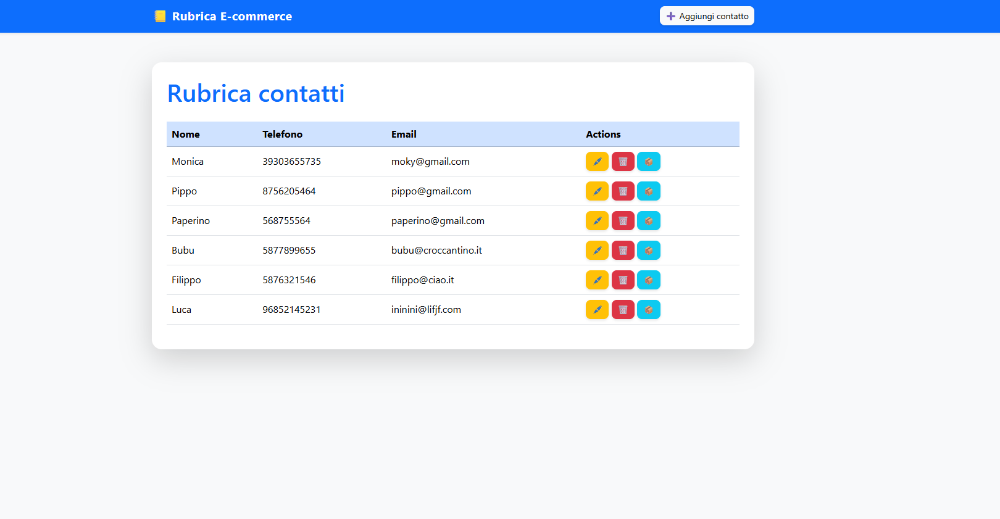
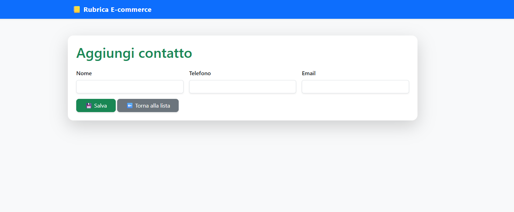
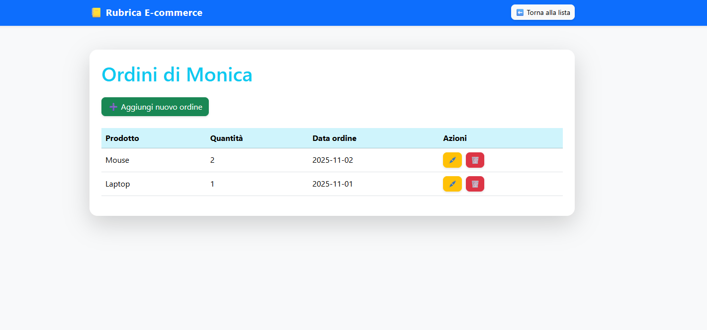
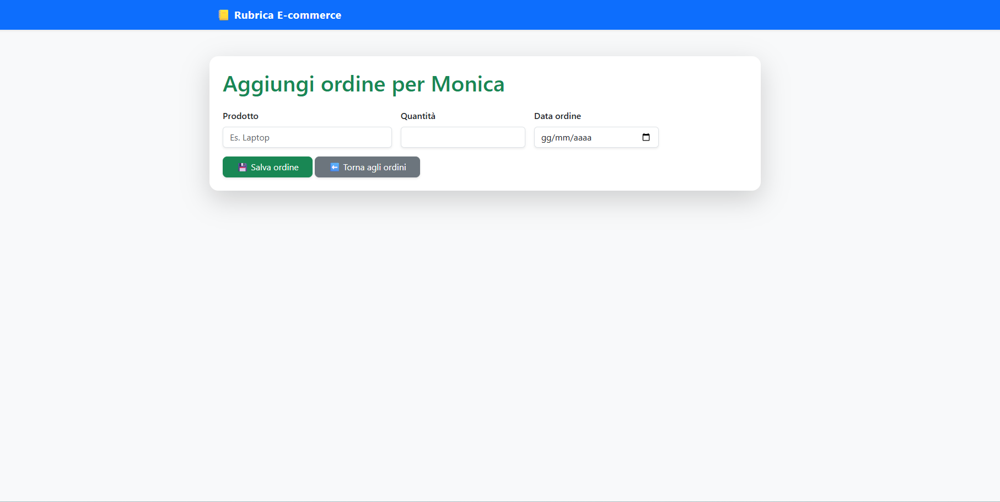
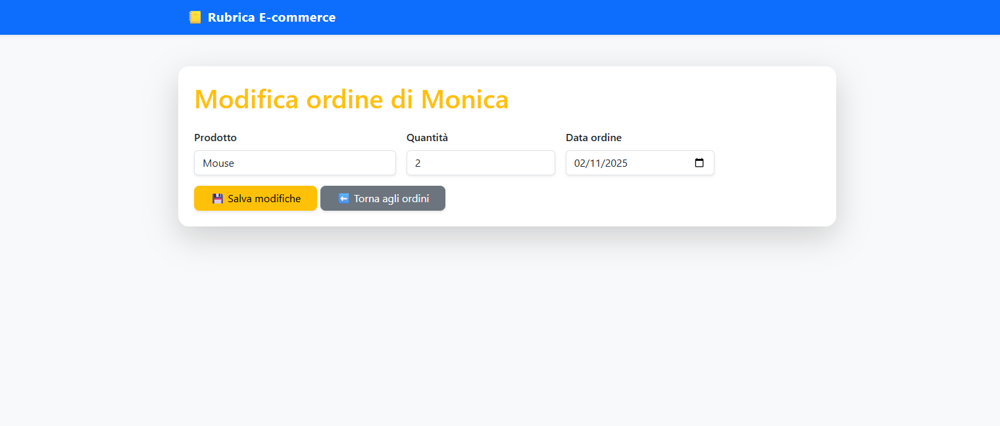

# 🛒 Ecommerce PHP

Applicazione PHP per gestire una **rubrica contatti** e i loro **ordini**.  
Permette di **aggiungere**, **visualizzare**, **modificare** ed **eliminare** contatti e ordini.  
I dati vengono salvati in **MySQL** tramite **phpMyAdmin/XAMPP**.

---

*Novembre 2025*  
🧑‍💻 

---

   

  

  

  

  

---
🔨
| Nome | Linguaggio    | Versione |
|------|------------   |----------|      
| PHP  | backend       | 8.3      |
| XAMPP| Server locale | 8.x      |


👨‍💻
```bash
Avviare XAMPP
Start APACHE SERVER
http://localhost/nomedelfile.php
